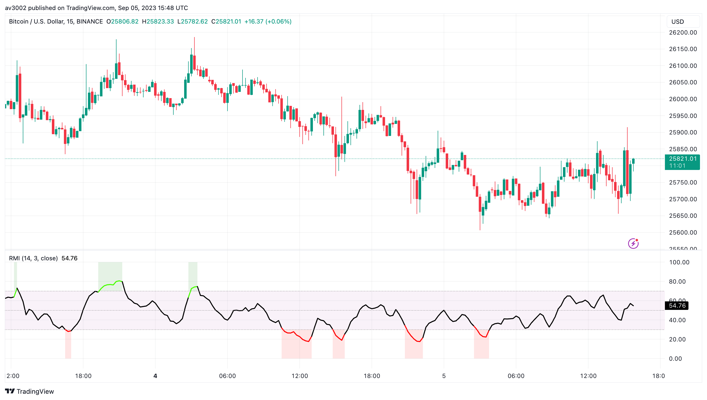
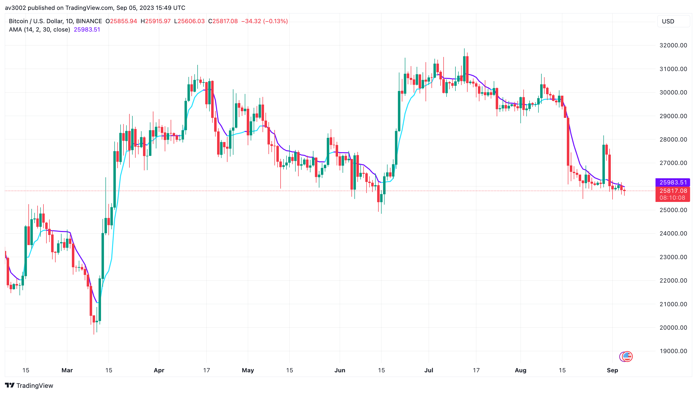
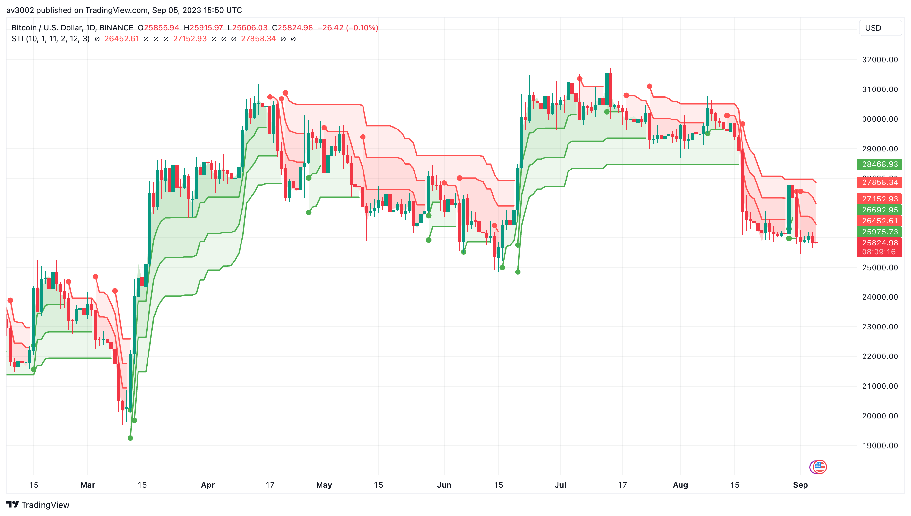
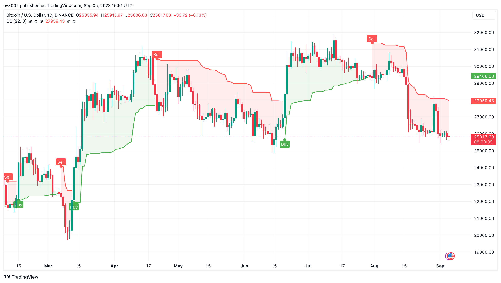

# 📊 Custom Strategy Indicators

Welcome to the Custom Strategy Indicators repository! In the world of stock market trading, having the right tools is crucial for success. These technical indicators are designed to provide you with valuable insights, helping you make informed decisions and enhance your trading strategies.

## Why Technical Indicators Matter

Technical indicators play a pivotal role in stock market trading by providing traders and investors with essential data-driven insights. These indicators help you identify trends, gauge market momentum, set optimal entry and exit points, and manage risk effectively. By incorporating these indicators into your trading strategy, you gain a competitive edge in navigating the dynamic and often unpredictable world of financial markets.

## Included Indicators

1. 💹 Relative Momentum Index (RMI)
2. 📈 Adaptive Moving Average (AMA)
3. 🌀 Supertrend Indicator
4. ⛔ Chandelier Exit
5. 📊 Trend Strength Index (TSI)

## Indicator Descriptions

### Relative Momentum Index (RMI)

The Relative Momentum Index (RMI) is a custom momentum oscillator that combines elements of the Relative Strength Index (RSI) and Rate of Change (ROC). It offers a comprehensive view of an asset's momentum, helping traders make decisions based on its relative strength compared to historical data.

### Adaptive Moving Average (AMA)

The Adaptive Moving Average (AMA) adjusts the sensitivity of the moving average to market conditions. Unlike traditional moving averages, the AMA responds dynamically to changes in volatility, offering a smoother and more adaptive trend-following indicator.

### Supertrend Indicator

The Supertrend Indicator is a custom trend-following tool that leverages price volatility. It provides clear signals for identifying trends and potential reversal points in the market, allowing traders to capitalize on price movements effectively.

### Chandelier Exit

Chandelier Exit is a volatility-based indicator that assists in determining stop-loss levels. By factoring in market volatility, it helps traders set appropriate stop-loss levels, ensuring protection against sudden and adverse price swings.

### Trend Strength Index (TSI)

The Trend Strength Index (TSI) measures trend strength by analyzing the interaction between price and volume. It offers a comprehensive view of a trend's strength, enabling traders to make more informed decisions based on both price and volume dynamics.

## Usage and Instructions

To incorporate these indicators into your trading strategy, follow these steps:

1. Import the indicator files into your preferred trading platform (e.g., TradingView).

2. Apply the indicators to your price charts.

3. Customize the indicator settings to align with your trading preferences.

4. Analyze the signals generated by each indicator to make informed trading decisions.

5. Explore the code examples and documentation provided in this repository for detailed instructions on customization and usage.

Enhance your trading game with these powerful custom indicators and gain a competitive edge in the stock market. Happy trading! 🚀💰📉
